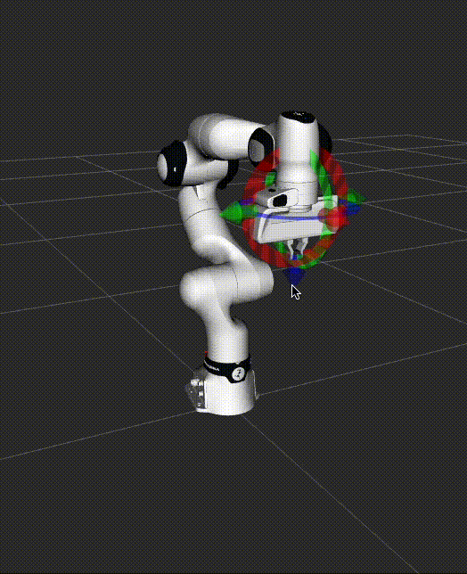

# RoboPlan ROS

ROS 2 wrappers for the [RoboPlan](https://github.com/open-planning/roboplan) motion planning library.

Refer to the [full documentation](https://roboplan-ros.readthedocs.io) for more information.

---

## Packages list

The main folders found in this repo are as follows.

- `roboplan` : Upstream library as a submodule for development and testing.
- `roboplan_ros_cpp` : C++ based ROS 2 functions for RoboPlan.
- `roboplan_ros_py` : Python based ROS 2 functions for RoboPlan.
- `roboplan_ros_visualization` : Tools for visualizing and interacting with RoboPlan with ROS 2 infrastructure.
- `roboplan_ros_examples` : Examples and demos using the ROS 2 wrappers.
- `docs` : The documentation source.

---

