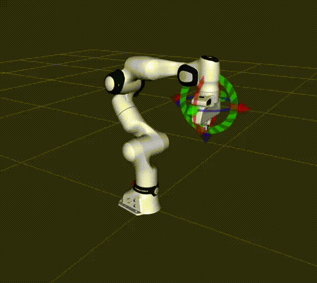

RoboPlan ROS Examples
=====================

As noted in :ref:`design_philosophy`, RoboPlan ROS is not intended to provide monolithic solutions that fit all planning applications.
The packages in the `roboplan_ros_examples <https://github.com/open-planning/roboplan-ros/tree/main/roboplan_ros_examples>`_ folder provide jumping off points for Developers looking to use RoboPlan in ROS 2 environments.
Each example is a self-contained application that demonstrates a specific workflow.

Most examples use ``ros2_control`` mock hardware, so no physical robot is required to run them.
There is also a dynamic simulation example using `MuJoCo <https://mujoco.org>`_.

Sample RRT Plan and Execute
---------------------------

This example demonstrates a complete plan-preview-execute loop using RRT motion planning with the Franka FR3 arm.

The example uses an interactive marker in RViz along with ROS ``Trigger`` services to:

1. **Set a target pose** by dragging the interactive marker in the RViz panel.
2. **Plan** a trajectory by right clicking and pressing "Plan", or by calling the ``/plan_and_execute_node/plan`` service.
3. **Preview** the planned trajectory by pressing "Preview", or by calling the ``/plan_and_execute_node/preview`` service.
4. **Execute** the trajectory by pressing "Execute", or by calling the ``/plan_and_execute_node/execute`` service.
   This wraps a call to the FR3's ``JointTrajectoryController``.
5. **Reset** the iMarker by pressing "Reset", or by calling the ``/plan_and_execute_node/reset`` service.
6. **Open Gripper** and **Close Gripper** entries, also available as the ``~/open_gripper`` and ``~/close_gripper`` services.

To launch the demo,

::

    ros2 launch roboplan_ros_franka franka_example_planning.launch.yaml

.. figure:: media/sample_rrt_execution.gif
   :width: 600px

   Sample RRT planning and execution with the Franka FR3 arm.

Sample Cartesian Servoing with OInK
-----------------------------------

This example demonstrates real-time Cartesian servoing using OInK (Optimal Inverse Kinematics) with the Franka FR3 arm.

A background control loop continuously solves a single-step IK optimization, then publishes joint commands directly to track the interactive marker's pose.
The solver uses a prioritized task hierarchy:

- **Priority 1**: A frame task tracks the end-effector pose set by the interactive marker.
- **Priority 2**: A configuration task that regularizes toward the starting joint configuration.

Joint position and velocity limits are enforced as QP constraints.
A collision avoidance barrier can also be enabled with the ``avoid_collisions`` launch argument, which keeps the arm clear of self-collisions and any scene obstacles.

To launch the demo,

::

    ros2 launch roboplan_ros_franka franka_optimal_ik_streaming.launch.yaml

   Sample OInK pose tracking with the Franka FR3 arm.

Dynamic Simulation with MuJoCo
------------------------------

The examples can also run against a dynamic simulation using `mujoco_ros2_control <https://github.com/ros-controls/mujoco_ros2_control>`_, rather than mock hardware.

The MuJoCo model (MJCF) is auto-generated from the FR3 URDF at launch time using the ``robot_description_to_mjcf.sh`` conversion script from ``mujoco_ros2_control``.
Actuators and the coupled gripper tendon are defined in ``description/fr3_mujoco_inputs.xml``, and a tabletop scene with a graspable cube is merged in from ``description/fr3_mujoco_scene.xml``.
The table is also added to the RoboPlan planning scene (``config/fr3_mujoco_obstacles.yaml``), so IK and RRT planning avoid it.

To grasp the cube, move the marker to a pre-grasp pose above the cube and then select "Close Gripper".

To launch the demos, set the ``hardware_type:=mujoco`` launch argument.

::

    ros2 launch roboplan_ros_franka franka_example_planning.launch.yaml hardware_type:=mujoco

    ros2 launch roboplan_ros_franka franka_optimal_ik_streaming.launch.yaml hardware_type:=mujoco
